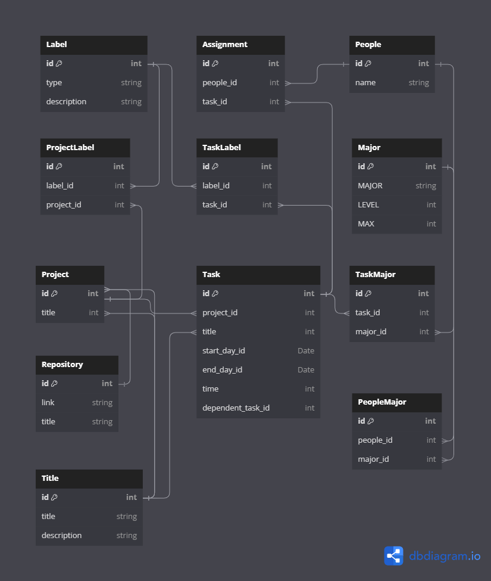

<!-- PROJECT LOGO -->
<br />
<div align="center">
  <a href="https://github.com/PhuongTrungTu/FinalMAT3514">
    
  </a>

<h2 align="center">Project Manager</h2>

  <p align="center">
    Mange your project for the best
    <br />
    <a href="https://github.com/PhuongTrungTu/FinalMAT3514/blob/main/README.md"><strong>Explore the docs »</strong></a>
    <br />
    <br />
    <a href="https://github.com/PhuongTrungTu/FinalMAT3514/issues">View Demo</a>
    ·
    <a href="https://github.com/PhuongTrungTu/FinalMAT3514/issues">Report Bug</a>
    ·
    <a href="https://github.com/PhuongTrungTu/FinalMAT3514/issues">Request Feature</a>
  </p>
</div>

<!-- ABOUT THE PROJECT -->
## About The Project

[![Product Name Screen Shot][product-screenshot]](https://example.com)

The task management application allows users to flexibly add, edit, and 
delete projects as well as tasks. Users can display information based on 
time, priority, task group, or board. It provides essential fields such 
as title, description, assignee, label, repository link, deadline date, 
and status. The ability to create custom fields reflects the specific 
characteristics of the project or task, creating a robust and flexible 
project management environment.

### Built With

This section should list any major frameworks/libraries used to bootstrap 
your project. Leave any add-ons/plugins for the acknowledgements section. 
Here are a few examples.

* [](https://www.java.com/)
* [](JQuery-url)
* [](https://github.com/FasterXML/jackson-databind)

<!-- GETTING STARTED -->
## Getting Started

Before start lets make sure you set up ```Jackson ObjectMapper``` to process json file.
You can read more about json process using ```Jackson ObjectMapper``` at [Intro to the Jackson ObjectMapper](https://www.baeldung.com/jackson-object-mapper-tutorial)


### Prerequisites
* Java
Make sure that change memory setting to at least 4GB.
Java version using in this project: ```java version: 19.0.2```

* Sql


* Jackson Object mapper

Let’s first add the following dependencies to the ```pom.xml```:
```
<dependencies>
        <dependency>
            <groupId>com.fasterxml.jackson.core</groupId>
            <artifactId>jackson-databind</artifactId>
            <version>2.12.5</version>
        </dependency>
</dependencies>
```

This dependency will also transitively add the following libraries to the classpath:
* jackson-annotations
* jackson-core

Always use the latest versions from the Maven central repository for jackson-databind.

### Installation


<!-- USAGE EXAMPLES -->
## Usage

This is Package Diagram show relation of packages


This is Class Diagram show relation of class


Database Diagram


<!-- ROADMAP -->
## Future Plans

We have an exciting roadmap for the future development of this project. 
Here are some of the key features and improvements we plan to implement:

### Subject Roadmap
- [x] All using structure in project
- [x] Create components in Project
- [ ] Writing and reading json file
- [ ] Store data using ```Jackson ObjectMapper```
- [x] Create new project
- [x] Create new task for project
- [x] Searching project
- [x] Delete project, delete task in project
- [x] Change status of task in project
- [ ] Display in normal view (Table)
- [x] Display task of project in the more near end day of each task
- [x] The relationship between tasks
- [x] Pathfinding algorithm
- [ ] Normal User interface
- [x] Priority Level of each task
- [ ] Database for store big data
- [x] manager display in console in normal mode
- [x] Automated workforce allocation for tasks. 

### After subject
- Mobile, web version
- Graphics User interface
- Sharing Projects Online with User Accounts
- AI suggesting for roadmap, solution, reference of project

See the [open issues](https://github.com/PhuongTrungTu/FinalMAT3514/issues) for a full list of proposed features (and known issues).


<!-- LICENSE -->
## License

Distributed under the GNU GENERAL PUBLIC License. See `LICENSE.txt` for more information.


<!-- CONTACT -->
## Contact

Hoàng Tuấn Tú (Grizmo) - [Hoàng Tú](https://www.facebook.com/tuantu2610/) - hoangtuantu893@gmail.com

Nguyễn Thị Hà Phương (Htmlexe) - [Nguyễn Phương](https://www.facebook.com/profile.php?id=100034060476971) - nguyenthihaphuong_t66@hus.edu.vn

Nguyễn Thành Trung (Mlisfi) - [Nguyễn Thành Trung](https://www.facebook.com/nguyenthanhtrung25) - nguyenthanhtrung_t66@hus.edu.vn

Project Link: [https://github.com/PhuongTrungTu/FinalMAT3514](https://github.com/PhuongTrungTu/FinalMAT3514)

<!-- ACKNOWLEDGMENTS -->
## Acknowledgments

Use this space to list resources you find helpful and would like to give credit to. I've included a few of my favorites to kick things off!

* [GNU GENERAL PUBLIC LICENSE](https://www.gnu.org/licenses/gpl-3.0.html)
* [GitHub Emoji Cheat Sheet](https://www.webpagefx.com/tools/emoji-cheat-sheet)
